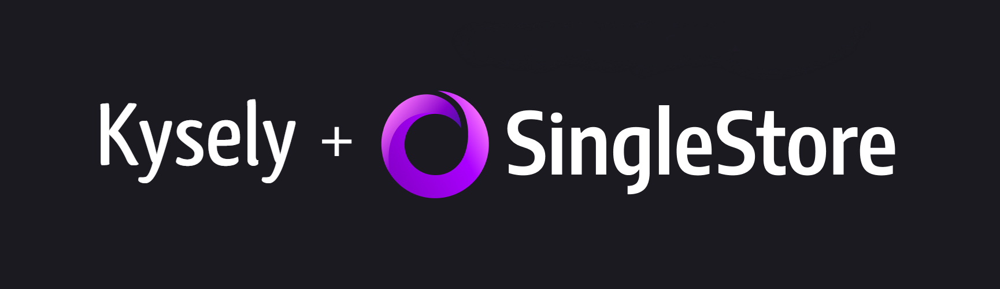

# kysely-singlestore

[](https://github.com/igalklebanov/kysely-singlestore/actions/workflows/tests.yml)
[](https://www.codacy.com/gh/igalklebanov/kysely-singlestore/dashboard?utm_source=github.com&utm_medium=referral&utm_content=igalklebanov/kysely-singlestore&utm_campaign=Badge_Grade)


[Kysely](https://github.com/koskimas/kysely) dialects, plugins and other goodies for [SingleStore](https://www.singlestore.com/) (formerly MemSQL).

## Installation

You should install [Kysely](https://github.com/koskimas/kysely) with `kysely-singlestore` as it is a required peer dependency.

```bash
npm i kysely-singlestore kysely
```

## Usage

### Data API Dialect

SingleStore Data API allows executing SQL queries in the browser and is a great fit for serverless functions and other auto-scaling compute services. It does not support transactions at this point in time.

Node.js (16.x) example:

```ts
import {Kysely} from 'kysely'
import {SingleStoreDataApiDialect, SingleStoreDataType} from 'kysely-singlestore'
import {fetch} from 'undici'

interface Database {
  person: {
    id: string
    first_name: string | null
    last_name: string | null
  }
  pet: {
    id: string
    name: string
    owner_id: string
  }
}

const db = new Kysely<Database>({
  dialect: new SingleStoreDataApiDialect({
    database: '<database>',
    deserialization: {
      castDatesAsNativeDates: true,
      castTinyIntAsBoolean: true,
      deserialize: (value, dataType, columnName) =>
        dataType === SingleStoreDataType.Json && columnName === 'pet' ? new Pet(value) : undefined,
      unwrapDecimals: true,
    },
    fetch,
    hostname: '<hostname>',
    password: '<password>',
    username: '<username>',
  }),
})
```

Browser example:

```ts
import {Kysely} from 'kysely'
import {SingleStoreDataApiDialect, SingleStoreDataType} from 'kysely-singlestore'

interface Database {
  person: {
    id: string
    first_name: string | null
    last_name: string | null
  }
  pet: {
    id: string
    name: string
    owner_id: string
  }
}

const db = new Kysely<Database>({
  dialect: new SingleStoreDataApiDialect({
    database: '<database>',
    deserialization: {
      castDatesAsNativeDates: true,
      castTinyIntAsBoolean: true,
      deserialize: (value, dataType, columnName) =>
        dataType === SingleStoreDataType.Json && columnName === 'pet' ? new Pet(value) : undefined,
      unwrapDecimals: true,
    },
    fetch: window.fetch.bind(window),
    hostname: '<hostname>',
    password: '<password>',
    username: '<username>',
  }),
})
```

### "Classic" Dialect - Soon<sup>TM</sup>

SingleStore is wire-compatible with MySQL so you can connect using `mysql2`, and take advantage of fast communication, connection pools and transactions.

## License

MIT License, see `LICENSE`
